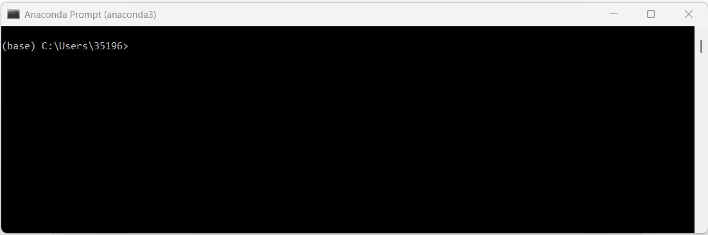
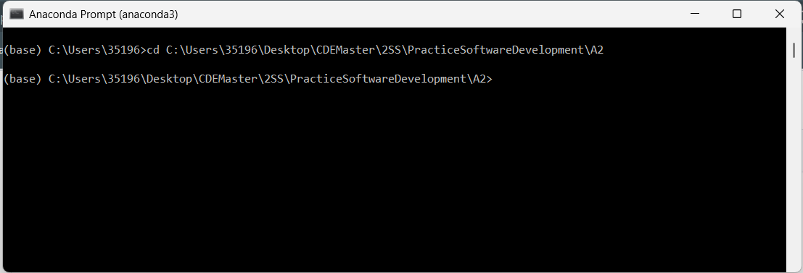
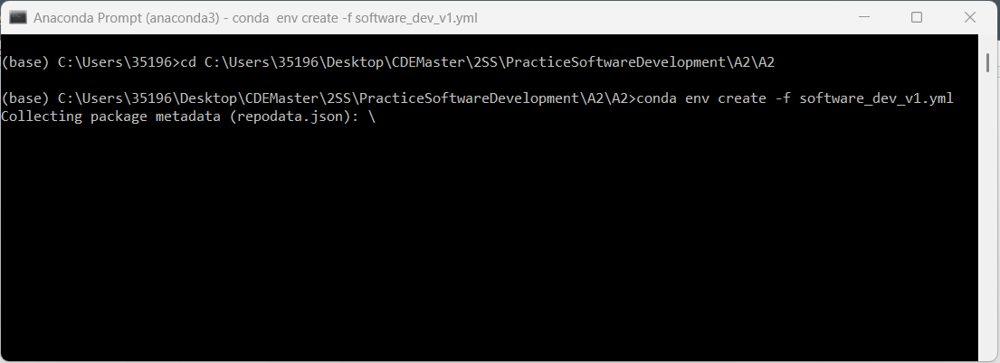
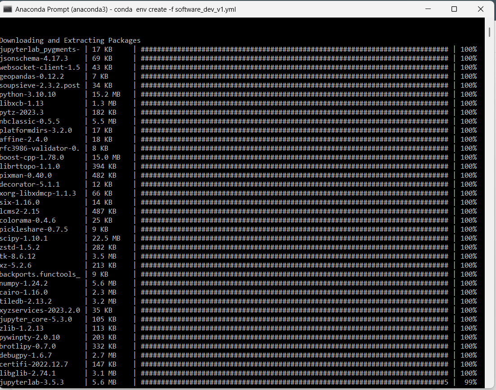
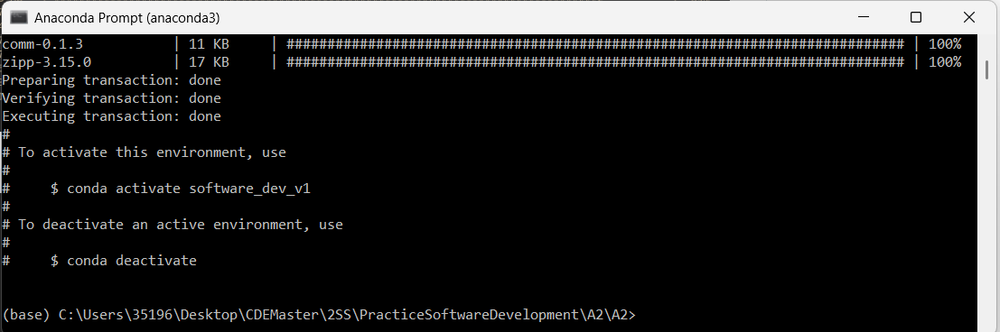
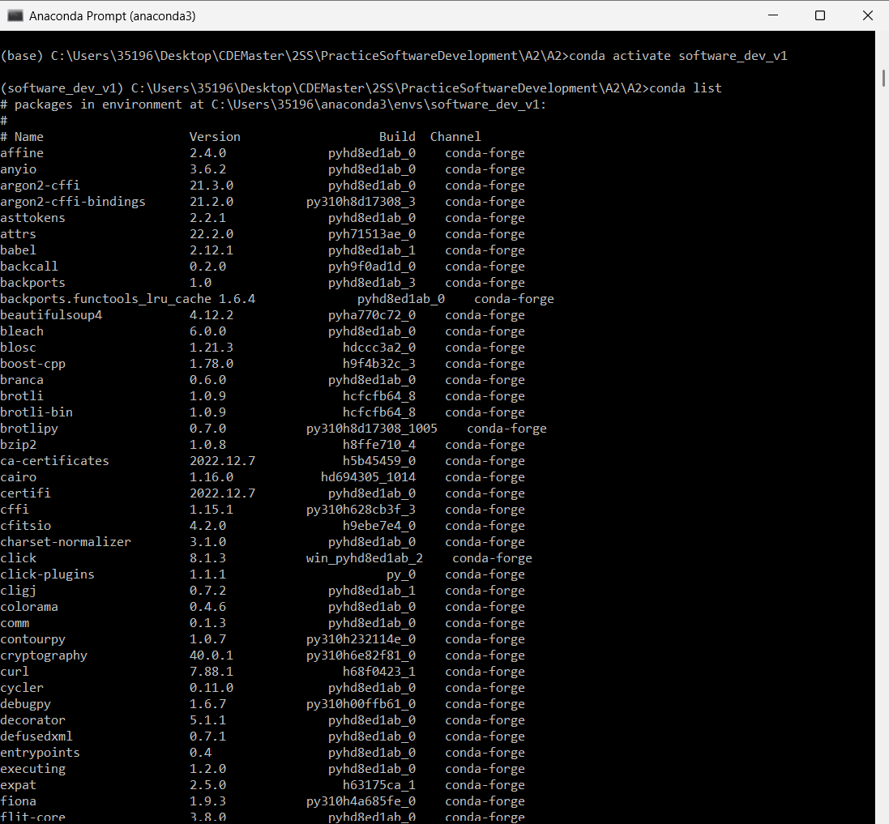

# PLUS_softwaredev_2025_beatrizbsperes
This repository is part of the work developed during the Practice: Software Development course from the CDE master.

## A2 - Recreating Conda Environments
This document will recreate the step on how to perform assignment 2 from Practice: Software Development Course. The goal of this task is to go through the process of re-creating and modifying an environment provided a priori. 

1. **Download the environment files individually:** I used the following link *https://github.com/augustinh22/geo-software-dev//archive/refs/heads/main.zip* to download the repository containing the necessary environment files. 
2. **Opening Anaconda Prompt:** I choose to recreate the two environment provided using the command line, that is the reason why I'm using the prompt. This is how the prompt image looks like before any command: 
3. **Changing directory** Next step is to move from the directory where are to the directory where we downloaded the environment. Check the image bellow to see how to do it. 
4. **Create the environment** Now we will actually recreate the environment from the two given environment. To do so we will create or own environment using the following command: `conda env create -f software_dev_v1.yml`. Check the images bellow to see the whole process:   **🔥 the proccess is finished!🔥** 
5. **Activate the environment** To activate the environment we just need to type the following simple command: `conda activate software_dev_v1.yml`. If later we we to deactivate the environment we just neet to type `conda deactivate`.
6. **Check the packages** Just for fun we can check the installed packages using the command `conda list`. See the image bellow :) 

7. **And it's done** Considering we need to recreate two enviroments, we just need to redo all the command but specifying the other environment we want to recreate. You can use the following command lines:  `conda env create -f software_dev_v2.yml` + `conda activate software_dev_v2.yml` + `conda list`

